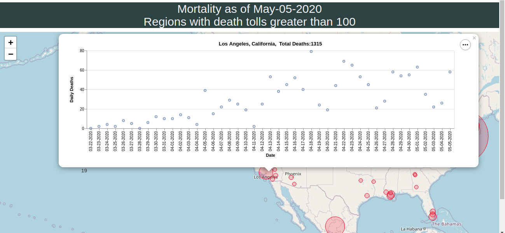
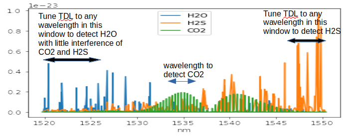

I am a physicist with interest in machine learning and data analytics. My expertise is in data modeling to predict hardware lifetime and reliability, and test algorithms. I have experience in conducting statistical analysis in product yield and design optimization.  In recent years, I continue to extend my knowledge in AI/Machine Learning through projects and teaching.
 
## Current Interests and Projects:
(under construction...)

1.Interactive Map and Embedded Data 
The first project shown here is an interactive COVID-19 map showing daily fatalities by country/region.

[Show map](https://tuengo-analytics.github.io/corona)

2.Spectroscopy
My second project is to search molecular absorption spectra in the near IR range.  The aim is to develop an optical analyzer to detect gas species such as H2S, CO2, and H2O.

