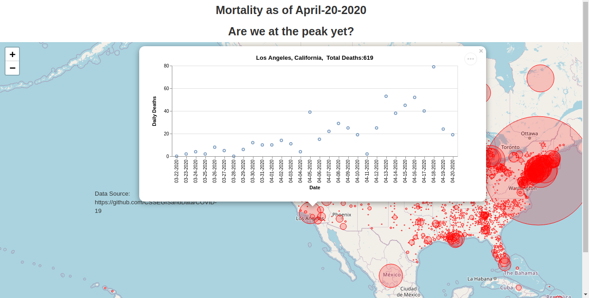

## About Me:
I am a physicist with interest in machine learning and data analytics. My expertise is in data modeling to predict hardware lifetime and reliability, and test algorithms. I have experience in conducting statistical analysis in product yield and design optimization.  In recent years, I continue to extend my knowledge in AI/Machine Learning through projects and teaching.
 
## Current Interests and Projects:
(under construction...)
* The first project shown here is an interactive COVID-19 map showing daily fatalities by country/region.

[Show map](https://tuengo-analytics.github.io/corona)

* The second project is to search a suitable wavelength window near infrared of molecular absorption spectra.  The aim is to develop an optical analyzer to detect gas species such as H2S, CO2, and H2O.
