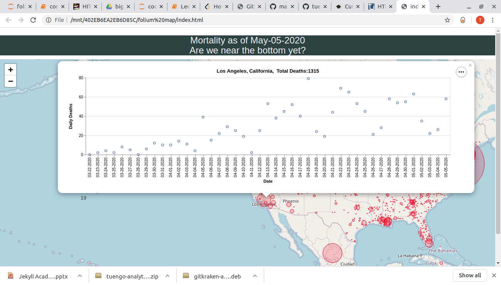

	
---
layout: page
excerpt: "About Me..."
---
I am a physicist with interest in machine learning and data analytics. My expertise is in data modeling to predict hardware lifetime and reliability, and test algorithms. I have experience in conducting statistical analysis in product yield and design optimization.  In recent years, I continue to extend my knowledge in AI/Machine Learning through projects and teaching.
 
## Current Interests and Projects:
(under construction...)
<ul>
	  <li>The first project shown here is an interactive COVID-19 map showing daily fatalities 			by country/region.
	  </li>
	  <li>The second project is to search a suitable wavelength window near infrared of 			molecular absorption spectra.  The aim is to develop an optical analyzer to detect 			gas species such as H2S, CO2, and H2O.
	  </li>

</ul> 
<body style="background-color:white;">
	
		
	<table>
	  <tr>
	    <td width="50%" valign="top" class="full" style="text-align: center">
		<h3 style="padding: 50 10 10 0; text-align: center">World Wide Daily Charts</h3>
		
 An interactive map showing daily charts by region/country

	      
	      <a href="https://tuengo-analytics.github.io/corona/" class="post-read more">[Show_More]</a>
	    </td>

	    <td width="50%" valign="top" class="full" style="text-align: center;">
		<h3>Spectra for H2S, CO2, and H2O detection </h3>
		<a href="https://hitran.org/">Data source is from HITRAN.org</a>
		
	    </td>
	  </tr>
	</table>
</body>

